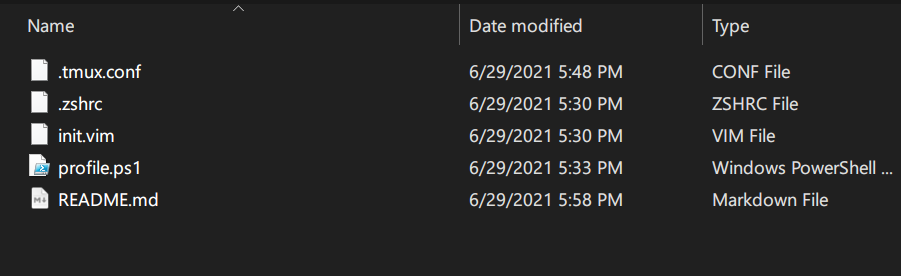

# **dotfiles**



Personal dotfiles (configuration files) for various applications.

## **Table of Contents**

- [**Description**](#description)
    - [Neovim](#Neovim)
    - [tmux](#tmux)
    - [zsh](#zsh)
    - [Windows Powershell](#windows-powershell)

## **Description**

### Neovim

`init.vim` is a configuration file for [Neovim](https://neovim.io/). This file should be placed in
- `~/.config/nvim` (in macOS and Linux)
- `$HOME/appdata/local/nvim` (in Windows)

The major changes are
- Popular recommended configurations (e.g. line numbers)
- [vim-plug](https://github.com/junegunn/vim-plug) for plugins
    - [vim-airline](https://github.com/vim-airline/vim-airline)
    - [nerdcommenter](https://github.com/preservim/nerdcommenter)
    - [vim-python-pep8-indent](https://github.com/Vimjas/vim-python-pep8-indent)
- [coc.nvim](https://github.com/neoclide/coc.nvim) for autocompletions
    - C/C++ ([coc-clangd](https://github.com/clangd/coc-clangd))
    - Python ([coc-pyright](https://github.com/fannheyward/coc-pyright))
    - Javascript ([coc-tsserver](https://github.com/neoclide/coc-tsserver))

### tmux

`.tmux.conf` is a configuration file for [tmux](https://github.com/tmux/tmux/wiki) (terminal multiplexer.) This file should be placed in home directory.

The major changes are
- Prefix key changed to `Ctrl+B`
- Pane number now starts from 1
- Mouse scroll integrations

### zsh

`.zshrc` is a configuration file for zsh. This file should be placed in home directory. Note that this is [oh-my-zsh](https://github.com/ohmyzsh/ohmyzsh) affected file.

The major changes are
- Many aliases I prefer (e.g. `v` for `nvim`)
- [fzf](https://github.com/junegunn/fzf) (fuzzy finder) commands (e.g. `cdf`)
- Added highlights to manpages with [bat](https://github.com/sharkdp/bat)

### Windows Powershell

`profile.ps1` is a configuration file for Windows Powershell. To customize Powershell configuration, first run the following command in administrator mode.

```ps1
Set-ExecutionPolicy RemoteSigned
```

Restart Powershell in user mode, then open the profile file with your favorite editor (e.g. `nvim`) such as follows.

```ps1
nvim $profile.currentUserAllHosts
```

The major changes are

- Many aliases I prefer (e.g. `l` for `dir`)
- `..`, `...`, `~` - Go to upper/2-levels above/home directory
- `cd -` - 1-level go to previous directory